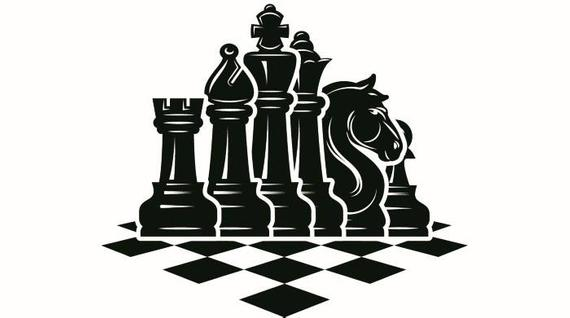

# ChessGame

<!-- PROJECT LOGO -->
 

  

  <h3 align="center">Chess Game</h3>

  
<!-- TABLE OF CONTENTS -->
## Table of Contents

* [About the Project](#about-the-project)
  * [Built With](#built-with)
* [Usage](#usage)
* [Contact](#contact)

<!-- ABOUT THE PROJECT -->
## About The Project

[![Product Name Screen Shot][product-screenshot]](./images/chess-game-example.png)

 Chess Game is an application created with react that allows players to compete against eachother playing a game of chess. Utilizing socket.io, players will compete in real-time. A message room is available between players/spectators. Ranking will also be implemented in order to match players into their specific skill level.

### Built With
This section lists the major frameworks that were used to build our project. 
* [Semantic UI](https://semantic-ui.com/)
* [React] (https://reactjs.org/)
* [Mongo,Mongoose] (https://www.mongodb.com/) (https://mongoosejs.com/)
* [Socket.io] (https://socket.io/)

## Challenges
The challenges our team faced within this project were:

<!-- DEMO -->
## Demo

Sign up or create an account to demo our fun and challenging chess game!
<!-- (//link to heroku or deployed project ) -->
<!-- //Recording of us playing game -->

<!-- CONTACT -->
## Contact

[Elizabeth Bodzy Github:](https://github.com/elizabethbodzy)
[Jeffrey Davis Github:](https://github.com/FeeterMcGeeter)
[Fred Nguyen Github:](https://github.com/fred-h-nguyen)

Project Link: [https://github.com/elizabethbodzy/ChessGame](https://github.com/elizabethbodzy/ChessGame)

<!-- MARKDOWN LINKS & IMAGES -->
<!-- https://www.markdownguide.org/basic-syntax/#reference-style-links -->
[contributors-shield]: https://img.shields.io/github/contributors/othneildrew/Best-README-Template.svg?style=flat-square
[contributors-url]: https://github.com/othneildrew/Best-README-Template/graphs/contributors
[forks-shield]: https://img.shields.io/github/forks/othneildrew/Best-README-Template.svg?style=flat-square
[forks-url]: https://github.com/othneildrew/Best-README-Template/network/members
[stars-shield]: https://img.shields.io/github/stars/othneildrew/Best-README-Template.svg?style=flat-square
[stars-url]: https://github.com/othneildrew/Best-README-Template/stargazers
[issues-shield]: https://img.shields.io/github/issues/othneildrew/Best-README-Template.svg?style=flat-square
[issues-url]: https://github.com/othneildrew/Best-README-Template/issues
[license-shield]: https://img.shields.io/github/license/othneildrew/Best-README-Template.svg?style=flat-square
[license-url]: https://github.com/othneildrew/Best-README-Template/blob/master/LICENSE.txt
[linkedin-shield]: https://img.shields.io/badge/-LinkedIn-black.svg?style=flat-square&logo=linkedin&colorB=555
[linkedin-url]: https://linkedin.com/in/othneildrew
[product-screenshot]: images/chess-game-example.png
